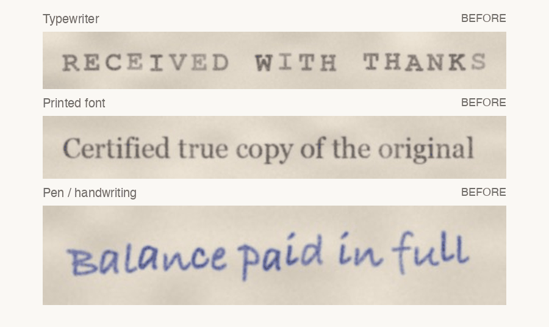

<h1 align="center">retype</h1>

<p align="center">
  <b>Change text in scanned documents and photos so it looks like it was always there.</b><br>
  Replace words in typewriter pages, printed forms and handwritten notes using the document's <i>own</i> letters:
  same ink, same font, same paper. Runs on a laptop CPU with no GPU and no AI model downloads.
</p>

<p align="center">
  <a href="https://github.com/StarkAg/retype/actions/workflows/ci.yml"></a>
  
  <a href="LICENSE"></a>
  
  <a href="https://github.com/StarkAg/retype/stargazers"></a>
</p>

<p align="center">
  
</p>

## Why retype?

Most "edit text in image" tools redraw the new words with a font or an AI model. On old or real-world
documents that shows: the ink is too even, the letters are too clean, and the style drifts.
**retype cuts the letters out of the original image and reassembles them**, so every copied letter keeps
the real ribbon wear, pen pressure, blur and colour.

| | retype | Font overlay tools | AI text editors (diffusion / GAN) |
|---|:---:|:---:|:---:|
| Uses the document's real ink | ✅ | ❌ | ❌ |
| Typewriter, printed **and** handwriting | ✅ | ⚠️ need the exact font | ✅ |
| Runs on CPU, no model download | ✅ | ✅ | ❌ GPU + weights |
| Deterministic, reports where each letter came from | ✅ | ✅ | ❌ |
| Invents letters the source doesn't have | ⚠️ fallback font | ✅ | ✅ |

## Quick start

```bash
pip install git+https://github.com/StarkAg/retype
retype photo.jpg --old "RECEIVED WITH THANKS" --new "RECEIVED WITH REGARDS"
```

`--old` must be exactly what the image says now, spaces included. retype uses it to work out which ink
shape is which letter. You get `*_same_spacing.png`, a `*_zoom.png` for checking quality, and a
`*_report.json`.

<details>
<summary><b>More examples</b></summary>

```bash
# Edit one line inside a full page and get the whole page back
retype page.jpg --region 120,840,980,900 --old "Paid in full" --new "Due in full"

# The document uses Courier and a letter you need isn't on the page
retype memo.jpg --old "..." --new "..." --font "/path/to/Courier New Bold.ttf"

# Keep a centred heading centred; darken the ink a little
retype heading.jpg --old "..." --new "..." --align center --darkness 1.1
```
</details>

## Examples

| Input → output | |
|---|---|
| **Typewriter** (monospace, uneven ribbon) |  |
| **Printed serif font** (proportional, touching letters like "fi") |  |
| **Blue-pen handwriting** (tilted line) |  |

All sample images are synthetic and generated by [`examples/make_samples.py`](examples/make_samples.py).

## Outputs

| File | What it is |
|---|---|
| `<name>_same_spacing.png/.jpg` | Original spacing. The image grows to the right if the new text is longer. |
| `<name>_fit_width.png/.jpg` | Squeezed to the original width. Only produced when the new text is longer. |
| `<name>_comparison.png` | Original and results stacked, 2×. |
| `<name>_zoom.png` | Original vs result at 4×, for checking letter quality. |
| `<name>_report.json` | Layout, measurements, and **where every output letter came from**. |
| `<name>_page_*.png` | With `--region`: the full page with the edit pasted in. |

The console output lists every letter that was **not** copied from the original. Check those in the
zoom image first.

## Options

| Option | Use it when |
|---|---|
| `--font PATH` | A letter you need isn't in the original. Pick a font close to the document: a typewriter font, the right serif/sans, or a handwriting font. |
| `--layout mono\|proportional` | Auto-detection picked the wrong one. Use `mono` for typewriters and fixed-width fonts. |
| `--align left\|center\|right` | The line should stay centred or right-aligned. |
| `--darkness 1.15` | The new text looks lighter or darker than the rest of the page. |
| `--gamma 1.0` | Keep the original's weak strikes exactly as they are. Lower values fill them in more. |
| `--seed N` | Try a different random ink/jitter variation. |
| `--plain-i` | Build `I` without typewriter serifs. |
| `--no-chunks`, `--no-deskew`, `--no-reinforce` | Turn off letter-group copying, straightening, or the M/W fill-in. |

## How it works

1. **Ink map.** A large median filter estimates the paper. Ink is how much darker each pixel is than
   the paper around it, measured per colour channel, so blue or red pen keeps its colour.
2. **Straighten.** A tilted line is detected from the letter positions and levelled. At the end, only
   the changed pixels are rotated back.
3. **Find letters.** Ink is split into 2-D shapes. A dynamic-programming alignment matches those shapes
   to the letters of `--old`, using typical letter widths. It rejoins a broken letter (a faint `C`),
   splits touching ones (`fi`, `ri`), and detects monospace vs proportional spacing.
4. **Cut out.** Every ink pixel is assigned to its nearest letter with a soft edge, so faint edges and pen
   joins survive. Loose specks of dirt are dropped.
5. **Clean paper.** The old text is inpainted and the image's own paper grain is laid back on top.
6. **Compose.** Letter groups that already appear in `--old` are copied whole, keeping real kerning and
   joins. The other letters come from the library, rotating through repeated copies. Missing letters are
   made in this order of preference:
   - **flip:** mirror of another letter (`b/d/p/q`, `n/u`; `M/W` for monospace).
   - **strokes:** built from real stems and bars (`H I L T E F`).
   - **font:** drawn with the `--font` fallback, matched to letter height, stroke weight, blur and ink colour.
7. **Finish.** Ink strength is evened out. Smooth ribbon/pen variation and ±1px baseline jitter are added,
   then a light sharpen matches the source's crispness.

## FAQ

**How do I change text in a scanned document without it looking edited?**
Crop the line (or pass `--region`), then run `retype scan.jpg --old "current text" --new "new text"`.
Because the new words are built from letters already on the page, the ink, font and paper texture match.

**Can it edit handwriting?**
Yes, for hand-printed or loosely joined writing. The more of the new text that already appears in the
line, the better, since whole letter groups are copied with their real joins.

**Does it work with any font?**
Any font in the image: typewriter, monospace, serif or sans, proportional. retype doesn't need to know
the font. It only needs a font file (`--font`) for letters that don't appear anywhere on the line.

**Does it need a GPU, internet access, or an AI model?**
No. It's classic computer vision (OpenCV + NumPy) and runs offline in about a second.

**What about letters that aren't in the original?**
They are flipped from a mirror letter, built from real strokes, or drawn with your fallback font. All of
these are flagged in the report. For many missing letters, see the neural tools under
[Related work](#related-work).

## Limitations

- One line per run; dark ink on lighter paper.
- Letters made from a flip, strokes or a font never match as well as copied ones.
- Joined-up cursive gets matching joins only where it reuses letter groups from the original.
- Very low resolution or heavy JPEG compression limits the quality.

## Use it responsibly

retype is for restoring, correcting and reworking **your own** documents, archives, film/theatre props,
art and datasets. Don't use it to alter official records, IDs, certificates, contracts or anything else
to deceive someone. That is forgery and is illegal almost everywhere.

## Use with Claude Code

[`claude-skill/SKILL.md`](claude-skill/SKILL.md) teaches Claude Code the whole workflow: running
retype, reading the report and zoom image, and iterating. Copy it and `retype.py` to
`~/.claude/skills/retype/`, then ask *"change the text in this scan to …"*.

## Related work

- [TextCtrl](https://github.com/weichaozeng/TextCtrl): diffusion-based scene text editing (NeurIPS 2024).
- [TextFlow](https://github.com/lyb18758/TextFlow): training-free scene text editing (2026).
- [DiffSTE](https://github.com/UCSB-NLP-Chang/DiffSTE): diffusion scene text editing.
- [STEFANN](https://github.com/prasunroy/stefann): generates a missing character in the same font (CVPR 2020).
- [AnyText](https://github.com/tyxsspa/AnyText): multilingual text generation and editing in images.
- [IntelliDoc](https://github.com/suyog-gautam/intellidoc): in-browser scanned-document editor that re-renders words with measured style.

## Contributing

Bug reports with a before/after image help most. See [CONTRIBUTING.md](CONTRIBUTING.md).
If retype saved you time, **a ⭐ helps other people find it.**

## License

MIT. See [LICENSE](LICENSE). Cite with [CITATION.cff](CITATION.cff).
