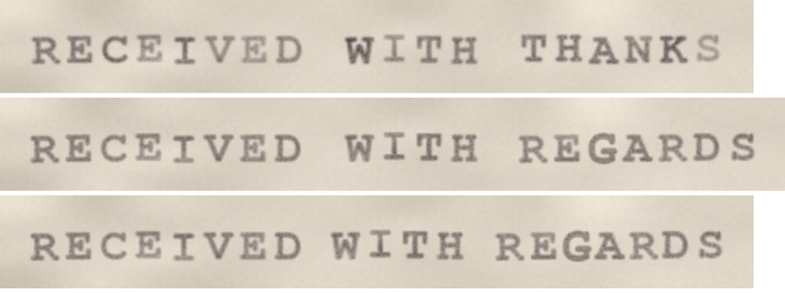
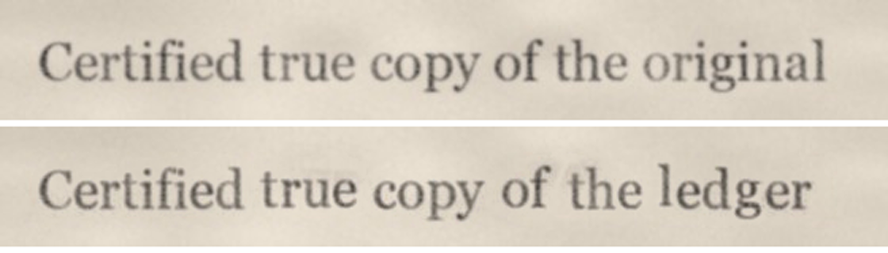
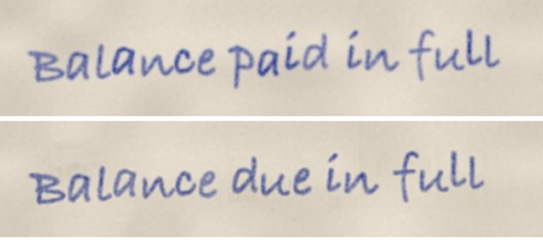

# retype

Replace a line of text in a photo or scan with new text **built from the document's own letters**.
Typewriters, printed fonts, and pen writing all work. The new text keeps the original ink, letter shapes,
spacing, and paper grain, because it is made from pieces of the original instead of being drawn with a font.

| | |
|---|---|
| **Typewriter** (monospace, uneven ribbon) |  |
| **Printed** (proportional serif font) |  |
| **Hand-printed** (blue pen, tilted line) |  |

In each pair the top line is the input and the lines below are retype's output.
All sample images are synthetic and generated by [`examples/make_samples.py`](examples/make_samples.py).

## Install

```bash
pip install -r requirements.txt   # opencv-python, numpy, pillow
```

Python 3.9+. No GPU and no model downloads needed.

## Usage

```bash
python3 retype.py examples/typewriter.jpg \
    --old "RECEIVED WITH THANKS" \
    --new "RECEIVED WITH REGARDS" \
    --font "/System/Library/Fonts/Supplemental/Courier New Bold.ttf" \
    --out-dir out
```

`--old` must be exactly what is written in the image, spaces included. retype uses it to work out
which ink shape is which letter.

To edit one line inside a full page, pass the line's box and get the whole page back:

```bash
python3 retype.py page.jpg --region 120,840,980,900 --old "..." --new "..."
```

### Outputs

| File | What it is |
|---|---|
| `<name>_same_spacing.png/.jpg` | Original spacing. The image grows to the right if the new text is longer. |
| `<name>_fit_width.png/.jpg` | Squeezed to the original width. Only produced when the new text is longer. |
| `<name>_comparison.png` | Original and results stacked, 2×. |
| `<name>_zoom.png` | Original vs result at 4×, for checking letter quality. |
| `<name>_report.json` | Layout, measurements, and **where every output letter came from**. |
| `<name>_page_*.png` | With `--region`: full page with the edit pasted in. |

The console output lists every letter that was **not** copied from the original.
Check those in the zoom image first.

### Options

| Option | Use it when |
|---|---|
| `--font PATH` | A letter you need isn't in the original. Point it at a font close to the document: a typewriter font for typed text, the right serif/sans for print, a handwriting font for pen. |
| `--layout mono\|proportional` | Auto-detection picked the wrong one. Use `mono` for typewriters and fixed-width fonts. |
| `--align left\|center\|right` | The line should stay centred or right-aligned. |
| `--darkness 1.15` | The new text looks lighter or darker than the rest of the page. |
| `--gamma 1.0` | Keep the original's weak strikes exactly as they are. Lower values fill them in more. |
| `--seed N` | Try a different random ink/jitter variation. |
| `--plain-i` | Build `I` without typewriter serifs. |
| `--no-chunks`, `--no-deskew`, `--no-reinforce` | Turn off letter-group copying, straightening, or the M/W fill-in. |

## How it works

1. **Ink map.** A large median filter estimates the paper brightness. Ink is how much darker each pixel is
   than the paper around it, measured per colour channel, so blue or red pen keeps its colour.
2. **Straighten.** A tilted line is detected from the letter positions and levelled. At the end, only
   the changed pixels are rotated back, so the rest of the image is untouched.
3. **Find letters.** Strong ink is split into 2-D shapes. A dynamic-programming alignment matches those
   shapes to the letters of `--old`, using typical letter widths. A broken letter (e.g. a faint `C`)
   becomes one letter again, and touching letters (e.g. `fi`, `ri`) are split. If the letters sit on a
   regular grid the text is treated as **monospace**; otherwise letter gaps and word gaps are measured.
4. **Cut out.** Every ink pixel is assigned to its nearest letter with a soft edge, so faint edges and
   pen joins survive. Loose specks of dirt are dropped.
5. **Clean paper.** The old text is inpainted and real paper grain from the same image is laid back on top.
6. **Compose.** Groups of 2+ letters that already appear in `--old` are copied as one piece, which keeps
   the real spacing and joins. The other letters come from the library. Repeated letters rotate
   through all the copies the source has. Missing letters are made, in this order of preference:
   - **flip:** mirror of another letter (`b/d/p/q`, `n/u`; `M/W` for monospace).
   - **strokes:** built from real stems and bars of the source (`H I L T E F`).
   - **font:** drawn with the `--font` fallback, matched to letter height, stroke weight, blur and ink colour.
7. **Finish.** Ink strength is evened out. Smooth ribbon/pen variation and ±1px baseline jitter are added,
   then a light sharpen matches the source's crispness.

## Limitations

- One line at a time, dark ink on lighter paper.
- Letters that aren't in the original come from a font or a flip, and these never match as well as
  copied letters. The more of the new text already appears in the old text, the better the result.
- Joined-up cursive works best when the new words reuse letter groups from the old line. Single cursive
  letters placed next to new neighbours won't have matching joins.
- Very low-resolution or heavily compressed images limit the quality.

## Use it responsibly

This tool is for restoring, correcting, and reworking **your own** documents, archives, props, and art.
Don't use it to alter official records, IDs, certificates, contracts, or anything else to deceive
someone. That is forgery and is illegal almost everywhere.

## Related work

retype reuses the document's real ink, so letters that exist in the source can't drift from its style.
It runs on CPU with no model weights. If a lot of letters are missing from the source, or you're editing
signs and photos rather than documents, these projects generate text in a matching style instead.
They need a GPU and model weights, and they redraw letters rather than reusing the original ink:

- [TextCtrl](https://github.com/weichaozeng/TextCtrl): diffusion-based scene text editing with style/glyph priors (NeurIPS 2024).
- [TextFlow](https://github.com/lyb18758/TextFlow): training-free scene text editing (2026).
- [DiffSTE](https://github.com/UCSB-NLP-Chang/DiffSTE): diffusion scene text editing with character + instruction encoders.
- [STEFANN](https://github.com/prasunroy/stefann): generates a missing character from other characters of the same font (CVPR 2020).
- [AnyText](https://github.com/tyxsspa/AnyText): multilingual text generation and editing in images.
- [IntelliDoc](https://github.com/suyog-gautam/intellidoc): in-browser editor for scanned documents that re-renders words with measured style.

## Use with Claude Code

[`claude-skill/SKILL.md`](claude-skill/SKILL.md) is a skill that teaches Claude Code this workflow.
Copy the folder to `~/.claude/skills/retype/` (together with `retype.py`), then ask Claude
something like: *"change the name in this scan to …"*.

## License

MIT. See [LICENSE](LICENSE).
